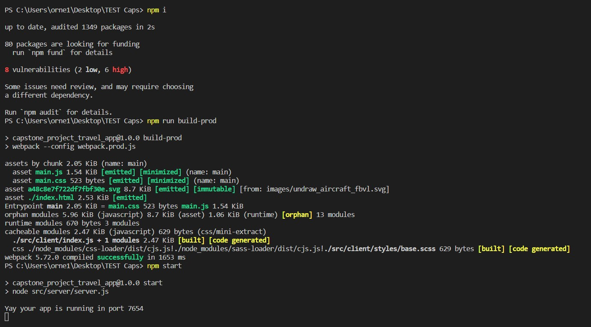
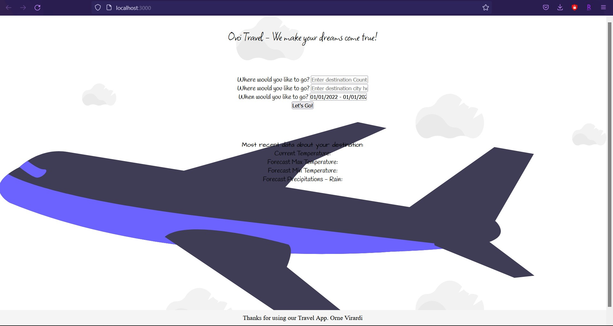

# Travel App

This Travel Apps represents the capstone project for the Front End Web Development Nanodegree program @ Udacity. 

## Project Description

With this tool, the user can choose a Country, a City and a Date, and the app will return the current temperature, the forecast max & min temperatures and the expected precipitations as well.

## How to Install and Run the Project

To install and run this project, run the commands as follow:

```
$ npm i

$ npm run build-prod

$ npm start

$ npm test
```

After following this steps, a dist folder should be automatically created by webpack and the project will run in port 1111.



The app should look like this:


## DEMO Video:

https://clipchamp.com/watch/mGPAHPq6QOh

## Tech Used:

* Html
* SASS
* Webpack to build
* Express to create the app
* Body-Parser as middleware
* Cors (Cross-origin resource sharing)
* Babel to translate ES5-ES6
* Javascript 


